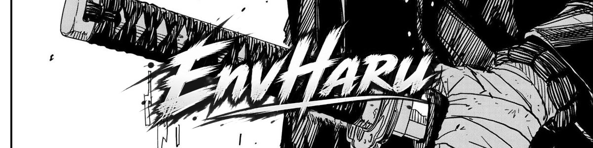

<p align="center" style="width: 100%;">
  
</p>

<p align="center">
  
</p>

<p align="center">
  <a href="https://github.com/EnvHaru">
    
  </a>
  <a href="https://github.com/EnvHaru">
    
  </a>
  <a href="https://www.instagram.com/env.haru/" target="_blank">
    
  </a>
  <a href="https://web.facebook.com/haru.indr/" target="_blank">
    
  </a>
</p>

```
┌─── Matrix Node: EnvHaru ────────────────────────────────────────────────────────┐
│                                                                                 │
│   [01] SYSTEM OVERVIEW                                                          │
│   Full-stack developer focused on web technologies, cross-platform              │
│   applications, and Linux systems optimization.                                 │
│                                                                                 │
└─────────────────────────────────────────────────────────────────────────────────┘
```

<!-- GRID MATRIX SECTION -->
<table align="center" style="border-collapse: collapse; border: 1px solid #333; background-color: #0d0d0d; width: 100%;">
  <tr>
    <td width="30%" valign="top" style="border: 1px solid #333; padding: 15px; background: #000000; color: #ffffff;">
      <h4 align="center" style="color: #ffffff; border-bottom: 1px solid #333; padding-bottom: 5px;">⚡ DEV_STACK</h4>
      <p style="font-family: monospace; font-size: 12px; line-height: 1.6;">
        ■ <b>PHP / Laravel</b><br>
        ■ <b>Flutter / Dart</b><br>
        ■ <b>Tailwind CSS</b><br>
        ■ <b>Alpine.js</b><br>
        ■ <b>Python / Node.js</b>
      </p>
    </td>
    <td width="40%" align="center" valign="middle" style="border: 1px solid #333; padding: 10px; background: #050505;">
      
    </td>
    <td width="30%" valign="top" style="border: 1px solid #333; padding: 15px; background: #000000; color: #ffffff;">
      <h4 align="center" style="color: #ffffff; border-bottom: 1px solid #333; padding-bottom: 5px;">⚙️ SYS_ENV</h4>
      <p style="font-family: monospace; font-size: 12px; line-height: 1.6;">
        ■ <b>Fedora Linux</b><br>
        ■ <b>Nginx / Hosting</b><br>
        ■ <b>Docker / Git</b><br>
        ■ <b>VS Code</b><br>
        ■ <b>OBS Studio (VAAPI)</b>
      </p>
    </td>
  </tr>
</table>

<br>

<p align="center" style="width: 100%; margin-top: 10px;">
  
</p>